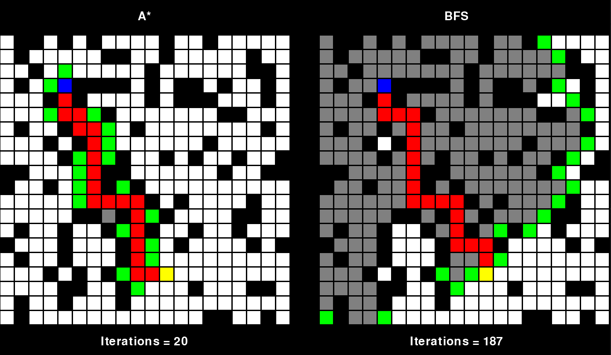

# path-finder
This is a visualization made using pygame of the BFS and A-STAR algorithms




To use it, run the main file with
```
python main.py
```
Make sure to have pygame installed, if you don't get it with

```
pip install pygame
```
